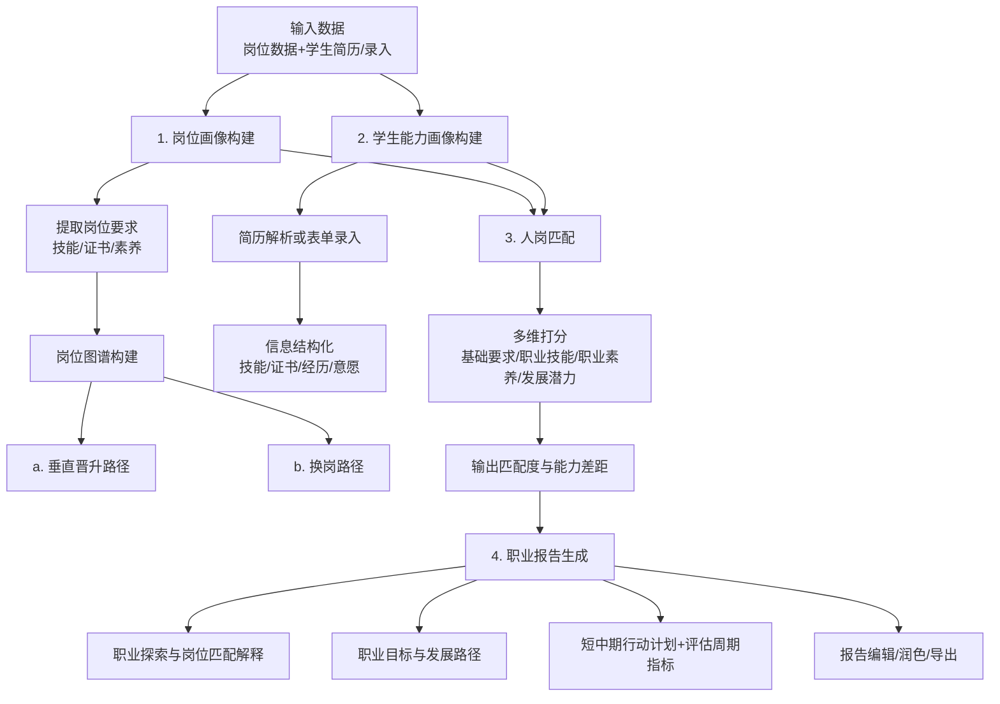

# 一、赛题要求
- 1. 岗位画像与岗位图谱
    - a). 垂直晋升
    - b). 换岗路径
- 2. 学生能力画像
    - 简历
    - 录入
    - 结构化
- 3. 人岗匹配
- 4. 职业报告

```mermaid
flowchart TD
    A[输入数据<br/>岗位数据+学生简历/录入] --> B[1. 岗位画像构建]
    B --> B1[提取岗位要求<br/>技能/证书/素养]
    B1 --> B2[岗位图谱构建]
    B2 --> B21[a. 垂直晋升路径]
    B2 --> B22[b. 换岗路径]

    A --> C[2. 学生能力画像构建]
    C --> C1[简历解析或表单录入]
    C1 --> C2[信息结构化<br/>技能/证书/经历/意愿]

    B --> D[3. 人岗匹配]
    C --> D
    D --> D1[多维打分<br/>基础要求/职业技能/职业素养/发展潜力]
    D1 --> D2[输出匹配度与能力差距]

    D2 --> E[4. 职业报告生成]
    E --> E1[职业探索与岗位匹配解释]
    E --> E2[职业目标与发展路径]
    E --> E3[短中期行动计划+评估周期指标]
    E --> E4[报告编辑/润色/导出]

```